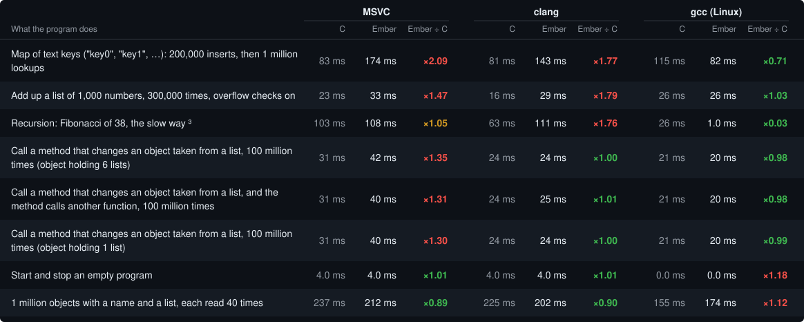

<p align="center">
  
</p>

Ember is an experimental, statically typed, ahead-of-time compiled language for systems and
application code. It aims for memory safety without a garbage collector, C-like speed, and
Python-like ergonomics: explicit ownership and borrowing, deterministic destruction, views that
carry their regions, reference-counted classes, generics with interfaces, and a portable C
backend. The full language also specifies effects and contracts, compile-time evaluation,
concurrency, C and C++ interoperability, data-oriented facilities, deterministic execution and hot
reload.

This repository holds the reference compiler (Rust), its C runtime, the standard library (written
in Ember), the language specification, the conformance suite, the diagnostics and their error
pages, and the records that keep them consistent.

> Ember is under active development and is not ready for production use. The compiler implements
> a large subset of the specification; the rest is rejected with `E0900` ("not implemented yet"),
> never silently accepted.

## Status

| | |
|---|---|
| Language version being implemented | **0.9.10**, specification `Ember_v0.9.10_Hardened_2` ([what changed from 0.9.9](docs/MIGRATION-0.9.10.md)) |
| Pinned development target | [`docs/spec-source/development-target.json`](docs/spec-source/development-target.json) → [`docs/spec-source/Ember_v0.9.10_Hardened_2.md`](docs/spec-source/Ember_v0.9.10_Hardened_2.md) |
| Specification sources | [`tasks/spec-0.9.9/parts/`](tasks/spec-0.9.9/parts/), one file per Part; each `Hardened_N` is their concatenation and is never edited afterwards |
| Last adopted normative specification | [`docs/spec-source/ember-spec.md`](docs/spec-source/ember-spec.md), 0.8.5_Hardened_1 (0.9.10 is adopted when its gates pass and the owner installs it) |
| Tests | Rust unit and integration suites; Ember run and conformance suites in [`tests/`](tests/) |
| Defects | Current fixed and open findings in [`docs/DEFECTS.md`](docs/DEFECTS.md) |
| Language decisions | Current owner decisions (ODRs) in [`docs/OWNER-QUEUE.md`](docs/OWNER-QUEUE.md) |
| CI | Linux (Clang, GCC) and Windows (MSVC, clang-cl); every push to `main` |

Phase estimates against 0.9.10 (2026-10-06; weighted by the size of each phase's rules;
method in [`docs/HANDOFF.md`](docs/HANDOFF.md)):

| Phase | Scope | Done |
|---|---|---:|
| 1 | Core language (Parts II–VI) | 99% |
| 2 | Ownership, borrowing, regions | 89% |
| 3 | Classes, reference counting, exclusivity | 64% |
| 4 | Effects, compile time, reflection, derives | 13% |
| 5 | C interoperability | 14% |
| 6 | Concurrency and data-oriented design | 4% |
| 7 | C++ interoperability and the interpreter | 0% |
| 7a | Iteration, determinism, cost control | 6% |
| 8 | Hardening and 1.0 | 17% |
| | Overall | 60% |

The latest language work is the owner's design G8-4, which made the language 0.9.10
([`docs/MIGRATION-0.9.10.md`](docs/MIGRATION-0.9.10.md)): every iterator counts and numbers its items
in a type that holds every count and number it can have (`u64`, `u128` and the 256-bit counts for
ranges too long for an `int`, stepping up only as far as the values need), and ranges, `rev`,
`take`, `skip`, `zip` and `chain` leave out a gigantic run of items at once. The owner's rulings of
2026-10-06 (specification 0.9.10_Hardened_2) then made the size of those numbers come from the
numbers the compiler knows (names set once and never changed, loop counters, lengths), kept
`enumerate`'s numbers from ever overflowing by stepping up to a bigger type, let `parse` read the
256-bit counts, and let a whole number go into another whole-number type by itself where the
compiler knows it fits. The same day's speed work gave a short list or string that a function
keeps to itself a buffer in the function's own frame (no allocation until it outgrows it), and
let the compiler know the numbers in a list held in an object's field from every place the
program stores into it, so a sum over it needs no overflow check. Before G8-4, the owner's
simplification pass
([`docs/proposals/Ember_Simplification_Pass_Revised.md`](docs/proposals/Ember_Simplification_Pass_Revised.md));
its rulings and current status are tracked in [`docs/OWNER-QUEUE.md`](docs/OWNER-QUEUE.md). It
covers associated-type defaults, `alloc_array` by `Default` and a separate `alloc_zeroed`, float
operators that stay IEEE in generic code, no early destruction, a memory-safety fix for borrows
through handles stored in objects, map lookups that need no key conversion (`AsKey`/`ToKey`),
`get_pair_mut`, when two const generic arguments are equal, and one storage rule for views in every
container (a `Map[str, int]` of string literals), checked at every store.

## What works today

- The whole pipeline: lexing, parsing, name resolution, type checking, HIR, MIR, borrow and region
  checking, C generation, native compilation and running.
- Scalars, including `i128`/`u128` and `f16`; structs, enums, tuples, fixed arrays, range types,
  pattern matching, destructuring, and Python-style control flow.
- Generic functions, types and methods, interface bounds, associated types (with defaults),
  blanket implementations, operator interfaces (`Add` … `Shr`, `Index`, `IndexMut`, `IndexSet`),
  and monomorphisation; a generic body is checked once, as generic code.
- Ownership and borrowing: moves, `owned`/`mut`/borrowed parameter modes, non-lexical borrows,
  views (`ref`, `Span`, `MutSpan`, `str`) with field-sensitive regions, deterministic destruction
  and drop flags.
- Classes: reference-counted handles, inheritance, virtual dispatch, weak handles, runtime
  exclusivity checks, and module privacy for methods and fields.
- The standard library in Ember: `Array`, `String`, `Map` and `Set` (insertion-ordered),
  `Option`/`Result`, `Cell`/`RefCell`, `Box`, arenas (`alloc_array`, `alloc_zeroed`,
  `alloc_uninit`, fixed-capacity collections), `NonZero[T]`, iterators and `for x in owned e`,
  text iterators (`chars`, `char_indices`, `bytes`, `lines`, `split`, `split_whitespace`),
  `std.math` (vectors, matrices, `KahanSum`, `Float` and `Number` generics) and `std.math.det`
  (bit-identical transcendental functions on every target).
- Diagnostics with stable codes, help and notes; `ember explain CODE` and error pages in
  [`docs/errors/`](docs/errors/).

Not built yet (rejected with `E0900`): most of effects and compile-time evaluation, several
derives (`Default`, `Ord`, `Serialize`), the FFI beyond the basics, threads and jobs, SIMD and
ECS facilities, C++ interop, the interpreter, and hot reload. The open defects are listed in
[`docs/DEFECTS.md`](docs/DEFECTS.md).

## Benchmarks

Each program below was written twice, in Ember and by hand in C (C++ for the programs that use
objects, strings, maps or sorting), built by the same C compiler with the same optimisation flags,
and timed on 2026-10-06 on one laptop, plugged in: an ASUS ROG Strix G16 (G615LR) with an Intel Core
Ultra 9 275HX (8 performance cores and 16 slower efficiency cores), 64 GB of DDR5-5600 memory and
Windows 11 Home (build 26200). The compilers are MSVC 19.44 and clang 22.1 on Windows, and gcc 15.2
under WSL (Ubuntu 26.04) on the same laptop. The Windows runs are held to the performance cores; WSL
cannot be held there without administrator rights, so the gcc runs ran where Windows placed them.
Overflow checks are on unless a row says they are off (`@overflow(wrap)`). Each table shows, for
each compiler, the hand-written C's time, Ember's time (each the middle of 11 or more runs), and
Ember's time divided by the C's: ×1.00 is the same speed, above 1 is slower, below 1 is faster.
Green is under ×1.05 (less than 5% slower than C, or faster), amber ×1.05 to ×1.10, red over ×1.10;
a value under ×0.95, in bold green, is a program Ember runs at least 5% faster than C.
A program goes in the table of its slowest compiler.

Each compiler's columns compare Ember with the hand-written C built by that compiler. On the rows
marked ¹ or ², MSVC rearranges the hand-written C's loops, which changes that C's time a lot; on the
row marked ³, gcc does something to Ember's program that it does not do to the hand-written C; the
notes under the tables say how. With gcc, both programs are built with
`-O2 -fvect-cost-model=cheap -funroll-loops`, the flags of Ember's release build with gcc.

### As fast as C or faster


### Close to C: up to 10% slower with one of the compilers


### More than 10% slower than C with at least one compiler

> Development is in progress, and attempts will be made to speed the language up in these areas.

More than 10% slower than C: 2 of the 50 programs with MSVC, 1 with clang, 2 with gcc; none with all
three.



¹ With MSVC, the hand-written C of this program runs faster than the same C built with clang. MSVC
turns its two loops around: it goes through the lists once and does all the rounds on each number in
turn, so each number is read from memory once instead of once per round, and it adds five rounds'
worth at a time. Ember's C for this program is written so that MSVC does the same.

² With MSVC, the hand-written C of this program runs much slower than the same C built with clang.
MSVC turns its two loops around here too, but then each number goes through all its rounds one after
another, where clang's build works on several numbers at once.

³ gcc rewrites Ember's recursive `fib` far more than the hand-written C's: it puts the function
inside itself and makes each repeated call once (to get `fib(38)`, Ember's build calls `fib` of 35,
34, 33 and 32 once each, where the plain recursion makes eight calls at that depth). The answer is
the same; with gcc this row does not measure what a call costs.

## Examples

Every standalone program example below compiles and runs with the current compiler.

```ember
fn main():
    println("Hello from Ember")
```

Interfaces and generics:

```ember
interface Shape:
    fn area(self) -> f64

struct Square implements Shape:
    side: f64

    fn area(self) -> f64:
        return self.side * self.side

fn total[T: Shape](shapes: Span[T]) -> f64:
    sum = 0.0
    for s in shapes:
        sum += s.area()
    return sum

fn main():
    squares = [Square(2.0), Square(3.0)]
    println(total(squares.as_span()))    # 13.0
```

Parameter modes and views:

```ember
fn increment(mut value: int):
    value += 1

fn longest(a: str, b: str) -> str:
    return a if a.len() >= b.len() else b

fn main():
    n = 10
    increment(n)
    println(n)                                   # 11
    words = ["ember", "compiler"]
    println(longest(words[0], words[1]))         # compiler
```

A `mut` parameter borrows the caller's variable for the call; no `&mut` is written at the call
site. `longest` returns a view of one of its arguments, and the compiler keeps both borrowed for as
long as the result lives.

Classes are reference-counted handles:

```ember
class Counter:
    count: int

    fn bump(mut self):
        self.count += 1

fn main():
    a = Counter(0)
    b = a
    b.bump()
    println(a.count, a is b)    # 1 true
```

Maps keep insertion order:

```ember
fn main():
    ages: Map[String, int] = {}
    ages["ann"] = 31
    ages["bob"] = 27
    for name, age in ages.items():
        println(name, age)
    println(ages.get("ann"), "cy" in ages)    # Some(31) false
```

More programs: [`examples/`](examples/), [`tests/run-pass/`](tests/run-pass/) and
[`tests/conformance/`](tests/conformance/) (one directory per specification rule).

## Build and run

You need a stable Rust toolchain and a C compiler (Clang, GCC or MSVC).

```text
cargo build --workspace
cargo run -p ember_driver --bin ember -- run path/to/program.em
```

The `ember` command:

```text
ember run   <file.em>        compile and run
ember build <file.em>        compile to an executable (--profile debug|release|shipping)
ember check <file.em>        type-check without generating code
ember build <file.em> --emit c|mir|hir|ast|tokens
ember explain E3060          describe a diagnostic code
ember inspect --safety <path>
```

`--cc clang|gcc|msvc` (or the environment variable `EMBER_CC`) overrides C compiler detection.

### Embed a static library from C

Build a C-compatible library for embedding in a C or C++ host. The full
MSVC and clang-cl suites, linked C/C++ archive tests, and repository gates
passed; see the [handoff](docs/HANDOFF.md) for details. In a package directory,
add `ember.toml` and use the default `src/lib.em` entry:

```toml
[package]
name = "demo_api"
version = "0.1.0"
language = "0.9.9"
kind = "staticlib"
```

```ember
@export("answer")
fn answer() -> i32:
    return 42
```

Run `ember build` from the package directory. With GNU-style toolchains, the
debug profile emits `target/debug/lib/libdemo_api.a` and `demo_api.h`, plus
`target/debug/lib/ember_runtime/libember_rt.a` and `ember_rt.h`. MSVC and
clang-cl use `demo_api.lib` and `ember_rt.lib` at the corresponding paths.

```c
#include "demo_api.h"
#include "ember_runtime/ember_rt.h"

int main(void) {
    (void)ember_rt_init(NULL);
    int result = answer();
    ember_rt_shutdown();
    return result == 42 ? 0 : 1;
}
```

On Linux, link the package archive before its runtime archive:

```sh
cc host.c -I target/debug/lib \
  -L target/debug/lib -ldemo_api \
  -L target/debug/lib/ember_runtime -lember_rt -lm -o host
./host
```

From a Windows Developer Command Prompt, use the matching toolchain and
profile:

```bat
cl /MD /std:c11 /I target\debug\lib host.c target\debug\lib\demo_api.lib target\debug\lib\ember_runtime\ember_rt.lib
host.exe
```

Use matching profile flags when linking; shipping builds retain their LTO
settings. The same archives can be linked from C++; use the C++ driver
(`c++`/`clang++` or `cl`) for a C++ host. `ember build --emit c` emits C, and
`ember build --emit header` emits only the header without invoking a C
compiler. `cdylib`, shared-runtime, and native-library packaging are not
implemented.

Tests:

```text
EMBER_CC=clang cargo test --workspace          # everything, including the conformance suite
python3 tasks/impl-0.9.9/annotations.py tests/conformance/MOD-2/   # one directory, quickly
```

The second needs `EMBER=target/debug/ember`. Specification and repository gates live in
[`tools/`](tools/) (`spec_check.py`, `rule_index.py`, `error_pages.py`, `hardening_check.py`,
`check_det.py`, …); CI runs them all.

## Repository map

```text
compiler/            the Rust crates: parser, typeck, hir, mir, analysis, codegen_c, driver, …
runtime/             the C runtime, generated from runtime/ember_rt/templates/
std/src/             the standard library, in Ember
tests/               conformance (by rule), run-pass, run-fail, compile-fail, compile-pass, ui
tools/               specification, registry, runtime and documentation gates
tasks/spec-0.9.9/    the 0.9.9 specification's sources and their build tools
docs/spec-source/    each Hardened_N, the adopted spec, and the pinned development target
docs/errors/         one page per diagnostic code
docs/proposals/      the owner's design proposals
docs/brand/          the logo: mark, icon, lockups and banner
examples/            standalone programs
```

## Project records

- [`docs/HANDOFF.md`](docs/HANDOFF.md) — the current state, next task and recipes (§0.355,
  "Start here").
- [`docs/OWNER-QUEUE.md`](docs/OWNER-QUEUE.md) — language decisions (ODRs) and their rulings.
- [`docs/DEFECTS.md`](docs/DEFECTS.md) — every compiler defect, with its fix and test.
- [`docs/DECISIONS.md`](docs/DECISIONS.md) — implementation decisions (ADRs).
- [`docs/MIGRATION-0.9.9.md`](docs/MIGRATION-0.9.9.md) — what changed for programs, dated.

## Development protocol

The specification is the contract; compiler behaviour and passing tests never override it.

1. Reproduce the behaviour with a minimal program.
2. Find the rule that governs it. If the specification is ambiguous, record an ODR, rule it, and
   cut the next `Hardened_N`; never edit a frozen `Hardened_N` or the specification to fit the
   compiler.
3. Fix the compiler, with a conformance test that fails without the fix (check it by breaking the
   fix), and record the defect.
4. Before pushing: the full test suite and every gate; then watch CI. `main` is never left red.

## Contributing

Read the "Start here" part of [`docs/HANDOFF.md`](docs/HANDOFF.md) first. Name the rule in every conformance test (`#$ rules:`),
and give every defect its failing program and its fix.
